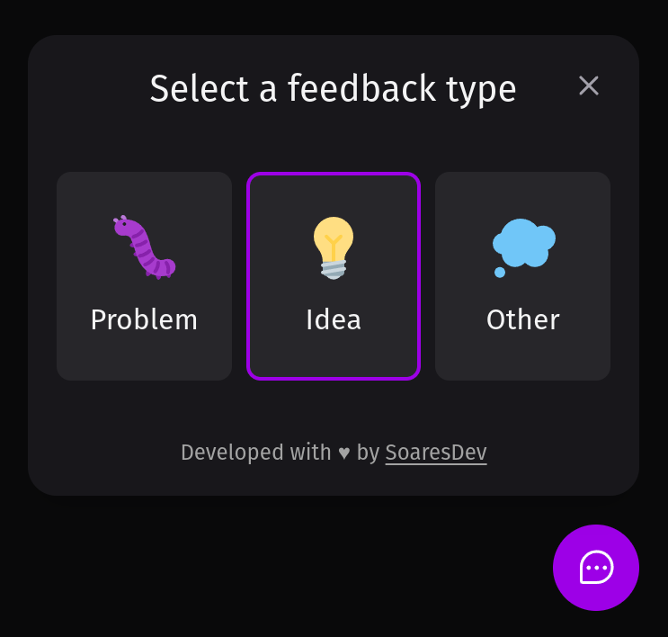
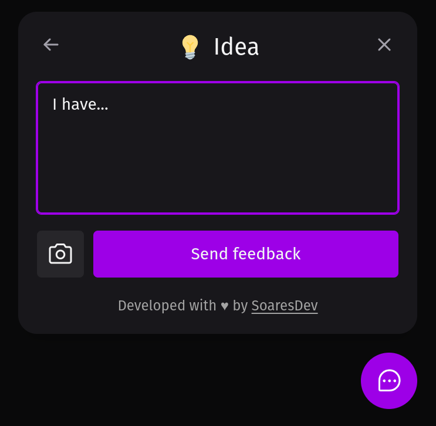

<div align="center" style="margin-bottom: 20px;">
  <h1>FEEDBACK WIDGET</h1>
  <p align="center">
    
    
    
    
    
    
  </p>  
</div>

## About project
FEEDBACK-WIDGET is a project developed with NodeJS, ReactJS and React Native using typescript, its function is to send feedbacks describing a problem, an idea or any other subject, the sending is done to the API that stores the data in a database and it also sends an email to the person responsible for the application.


## Main technologies
- [TypeScript](https://www.typescriptlang.org/docs/)
- [NodeJS](https://nodejs.org/en/)
- [ReactJS](https://pt-br.reactjs.org/)
- [React Native](https://reactnative.dev/)
- [Axios](https://axios-http.com/ptbr/docs/intro)
- [Prisma ORM](https://www.prisma.io/)
- [Tailwind CSS](https://tailwindui.com/)


## Repositories
- [Server](https://github.com/jefferson1104/feedback-widget/tree/main/server)
- [Web](https://github.com/jefferson1104/feedback-widget/tree/main/web)
- [Mobile](https://github.com/jefferson1104/feedback-widget/tree/main/mobile)


## Run project
First we need to run the API (SERVER) and then we can run the CLIENT (WEB) and MOBILE.

> NOTE: To run the mobile version of the project in the development environment, it is necessary to have Expo installed on your machine and the Expo Go APP installed on your smartphone, on your smartphone read the QR Code.

```bash
# clone repositories
$ git clone https://github.com/jefferson1104/feedback-widget.git


# API (SERVER)
# Run test
$ npm run test
# Run server project
$ npm run dev


# CLIENT (WEB)
# Run client project
$ npm run dev


# MOBILE
# Run mobile project using "Expo"
$ expo start --clear
```

## Screenshots


